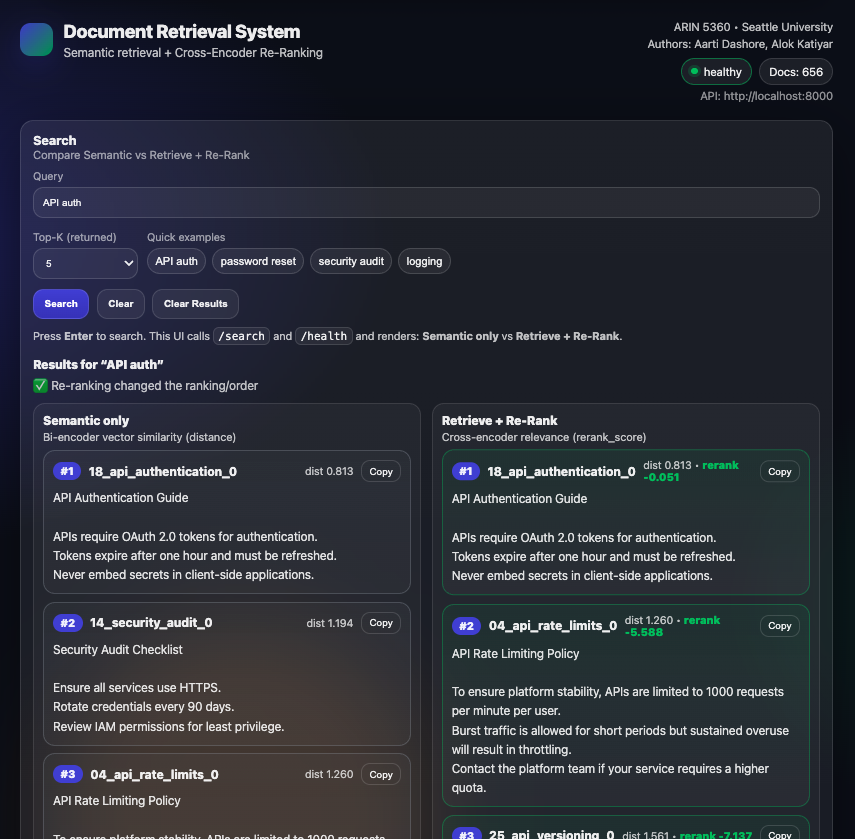
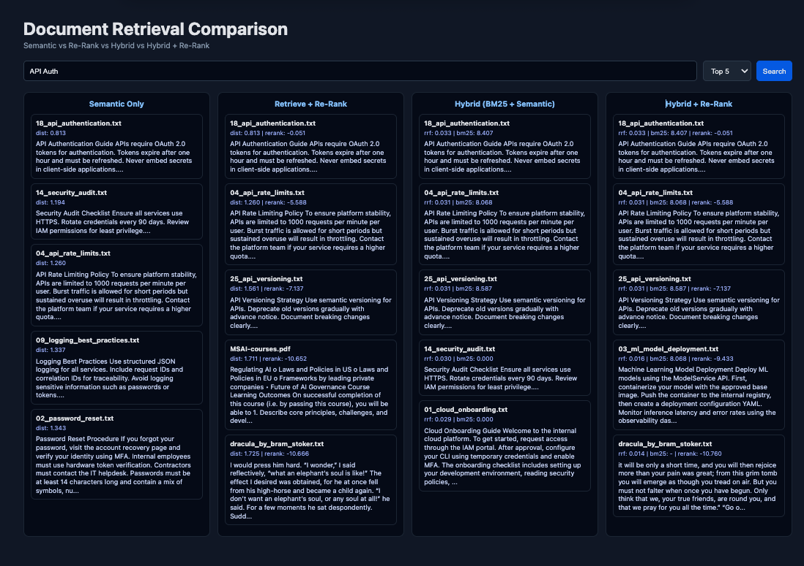

# P2: Advanced Document Retrieval System

## Overview

This project implements an **advanced document retrieval system** for a hypothetical case study, *Galactic Gadgets*, extending the semantic search system developed in Labs 3 and 4. While the baseline system supports semantic retrieval using bi-encoder embeddings, this project demonstrates **production-grade retrieval enhancements** used in real-world search systems.

The system introduces a **two-stage retrieval pipeline** in which fast semantic search retrieves candidate documents, followed by **cross-encoder reranking** to improve precision. As an optional extension, the project also implements **hybrid search**, combining semantic retrieval with keyword-based BM25 scoring via **Reciprocal Rank Fusion (RRF)**.

The project is implemented as a **FastAPI** service served with **uvicorn**, includes a lightweight web interface for comparison, and follows professional standards for testing, documentation, and code quality.

---

## Key Features

### Core Functionality (Required)
- Semantic document retrieval using sentence-transformer bi-encoders
- Indexing of both `.txt` and `.pdf` documents
- Intelligent document chunking with overlap
- Two-stage retrieval pipeline:
  1. Semantic search retrieves top-K candidate chunks
  2. Cross-encoder reranking improves result ordering
- Cross-encoder model:
  - `cross-encoder/ms-marco-MiniLM-L-6-v2`
- Configurable reranking (enabled or disabled per query)
- FastAPI web service with uvicorn
- Web UI displaying relevance scores
- Unit and integration tests demonstrating reranking effectiveness
- ≥80% test coverage of retrieval modules

### Extra Credit (Optional)
- Hybrid search combining:
  - Semantic similarity
  - BM25 keyword matching
- Reciprocal Rank Fusion (RRF) to merge rankings
- Configurable pipeline to compare:
  - Semantic only
  - Semantic + reranking
  - Hybrid only
  - Hybrid + reranking
- Tests validating hybrid search behavior and effectiveness

---

## Project Structure

```
P2-Document-Retrieval-System/
├── README.md
├── pyproject.toml
├── .gitignore
├── documents/              # Sample .txt and .pdf files
├── static/                 # Web UI
│   ├── index.html
│   └── style.css
├── src/
│   └── retrieval/
│       ├── main.py         # FastAPI application
│       ├── loader.py       # Document loading & chunking
│       ├── embeddings.py   # Bi-encoder embeddings
│       ├── store.py        # ChromaDB vector store
│       ├── retriever.py    # Retrieval pipeline orchestration
│       ├── reranker.py     # Cross-encoder reranking
│       └── hybrid.py       # BM25 + RRF (extra credit)
└── tests/
    ├── test_smoke.py
    ├── test_loader.py
    ├── test_embeddings.py
    ├── test_reranker.py
    ├── test_p2_reranking.py
    ├── test_hybrid.py
    ├── test_p2_hybrid.py
    └── test_integration.py
```

---

## Setup Instructions

```bash
git clone https://github.com/alokkatiyar11/P2-Document-Retrieval-System
cd P2-Document-Retrieval-System
uv sync
```

---

## Starting the Server

```bash
uv run uvicorn src.retrieval.main:app --reload
```

- API: http://localhost:8000
- Web UI: http://localhost:8000/

---

## Using the Retrieval System

### Comparison Mode

```json
{
  "query": "api authentication",
  "n_results": 5,
  "compare": true
}
```

Returns semantic, reranked, hybrid, and hybrid+reranked results.

---

## Screenshots & Visual Evidence

### Core Functionality


### Extra Credit

---

## Testing

```bash
uv run pytest --cov=src tests/ --cov-report=html
```

---

## Linting and Formatting

```bash
uv run ruff check .
uv run ruff format --check .
```

---

## Author

**Alok Katiyar**  
Seattle University – ARIN 5360
