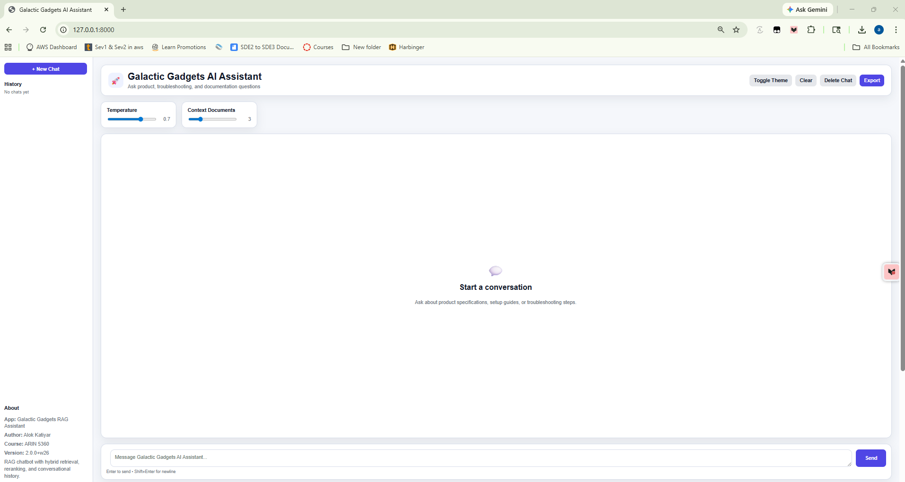
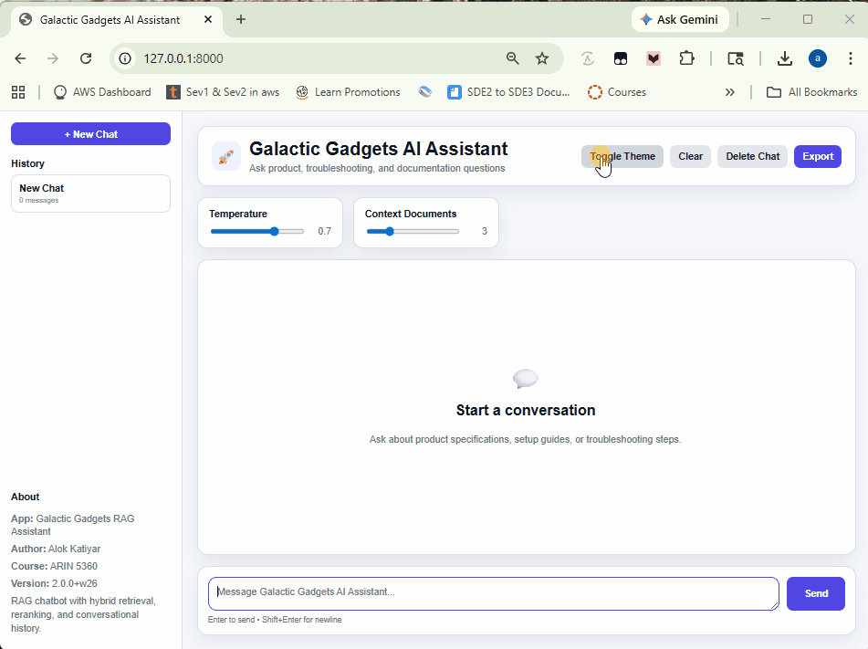

# Galactic Gadgets RAG Chatbot

**Author:** Alok Katiyar  
**Course:** ARIN 5360 — AI Systems Engineering  
**Project:** P3 Final Project — Galactic Gadgets RAG Chatbot  

## Optional Feature Implemented

**Option A — Conversation Memory**

---

## Pipeline Status

  
  
  


---

## Overview

This project implements a **production-style Retrieval-Augmented Generation (RAG) chatbot** for the fictional company **Galactic Gadgets**.

Customers can ask natural-language questions about company documentation, including:

- Product specifications
- Setup guides
- Troubleshooting instructions
- Technical documentation

Instead of returning raw search results, the system combines:

1. Document retrieval
2. Reranking
3. LLM generation
4. A modern chat interface

to produce contextual answers with **document citations**.


---
## Chat Demo

Below is a short demonstration of the RAG chatbot answering a question
and displaying document sources.


---
## RAG Architecture

The chatbot uses a Retrieval-Augmented Generation pipeline:

**User Question**  
↓  
**Semantic Search** (vector embeddings)  
↓  
**Reranking** (improves relevance)  
↓  
**Context Construction**  
↓  
**Prompt Creation**  
↓  
**LLM Generation** (Ollama by default)  
↓  
**Answer + Source Documents**

---

## Key Features

### Modern Chat Interface

The UI provides a conversational experience similar to ChatGPT.

Features include:

- Message bubbles for user and assistant
- Scrollable conversation history
- Auto-scroll to the latest message
- Loading indicator (“Assistant is typing...”)
- Timestamps on messages
- Clear conversation button
- Export chat functionality
- Responsive mobile/desktop layout

### Source Transparency

Each assistant response includes a **collapsible source panel** displaying:

- Document filename
- Similarity score
- Content preview
- Expandable full context

This improves **traceability and explainability**.

### Chat Settings

Users can adjust response behavior with a settings panel:

| Setting | Description |
|---|---|
| Temperature | Controls creativity of responses |
| Context Docs | Number of retrieved documents |
| Theme Toggle | Light / dark mode |
| Keyboard Shortcuts | Enter to send, Shift+Enter for newline |

Theme preference persists using **localStorage**.

---

## Optional Feature: Option A — Conversation Memory

The chatbot supports **multi-turn conversations**.

Recent conversation history is included in prompts sent to the LLM, enabling follow-up questions that depend on previous turns.

### Example

**User:** What is AstroLamp?  
**Assistant:** AstroLamp is a compact desk lamp...  
**User:** How do I change its brightness?  

The system correctly understands that **“its” refers to AstroLamp**.

Conversation history is:

- Stored in memory
- Available during the current session
- Cleared on page refresh
- Clearable manually through the UI

---

## Project Structure

```text
AskGalacticGadgets/
│
├── .github/
│   └── workflows/
│       └── ci.yml                  # CI/CD pipeline
│
├── README.md
├── .gitignore
├── .env.example                    # Environment configuration template
├── pyproject.toml                  # Project dependencies and tooling config
│
├── documents/                      # Sample documents used by the RAG system
│   ├── astrolamp_manual.pdf
│   ├── nebulanoise_headphones.pdf
│   ├── catalog.txt
│   ├── faq.txt
│   ├── shipping_returns.txt
│   ├── sample1.txt
│   ├── sample2.txt
│   ├── sample3.txt
│   ├── sample4.txt
│   └── sample5.txt
│
├── static/                         # Web chat interface
│   ├── index.html                  # Chat UI
│   ├── style.css                   # Styling and themes
│   └── chat.js                     # Chat functionality
│
├── src/
│   └── retrieval/                  # Backend retrieval + RAG logic
│       ├── __init__.py
│       ├── main.py                 # FastAPI application
│       ├── loader.py               # Document loading and parsing
│       ├── embeddings.py           # Embedding generation
│       ├── store.py                # Vector store management
│       ├── retriever.py            # Retrieval logic
│       ├── reranker.py             # Reranking model
│       ├── llm.py                  # LLM client (Ollama / OpenAI)
│       └── rag.py                  # RAG orchestration
│
└── tests/                          # Unit and integration tests
    ├── __init__.py
    ├── test_smoke.py
    ├── test_llm.py
    ├── test_rag.py
    ├── test_integration.py
    └── data/                       # Test documents used by tests
```

---

## Setup Instructions

### 1. Install dependencies

```bash
uv sync
```

### 2. Install Ollama

Download Ollama from the official site and install it on your machine.

Verify installation:

```bash
ollama list
```

### 3. Download the default model

```bash
ollama pull qwen2.5:3b
```

Verify Ollama is running:

```bash
curl http://localhost:11434/api/tags
```

---

## Environment Configuration

Copy the example file:

```bash
cp .env.example .env
```

Example configuration:

```env
LLM_BASE_URL=http://localhost:11434
LLM_MODEL=qwen2.5:3b
LLM_API_KEY=
DEFAULT_CONTEXT_DOCS=3
DEFAULT_TEMPERATURE=0.7
PORT=8081
```

### Environment Variables

- `LLM_BASE_URL` — Base URL for the LLM provider. Defaults to local Ollama.
- `LLM_MODEL` — Model name to use for generation.
- `LLM_API_KEY` — API key used when connecting to OpenAI-compatible endpoints.
- `DEFAULT_CONTEXT_DOCS` — Default number of retrieved documents used for answer generation.
- `DEFAULT_TEMPERATURE` — Default response creativity level.
- `PORT` — Port used by the FastAPI application.

---

## Start the Server

Run the FastAPI app with uvicorn:

```bash
uv run uvicorn src.retrieval.main:app --reload --port 8000
```

Open the interface in your browser:

```text
http://localhost:8000
```

---

## Example Questions

Try asking:

- What is RAG?
- What features do NebulaNoise headphones support?
- How do I adjust AstroLamp brightness?

Each response includes **document citations and source context**.

---

## Usage Examples

### Browser chat interface

1. Open the web interface.
2. Type a question into the chat box.
3. Adjust temperature or context settings if desired.
4. Review the response and expand the sources section.

### API example

```bash
curl -X POST http://localhost:8081/rag \
  -H "Content-Type: application/json" \
  -d '{"question": "What is AstroLamp?", "n_context_docs": 3, "temperature": 0.7}'
```

---

## Testing

Run tests with coverage:

```bash
uv run pytest --cov=src/retrieval tests/
```

Expected coverage: **100%**

Tests include:

- LLM client tests
- RAG system tests
- Integration tests
- Smoke tests

LLM calls are **mocked**, so tests pass even when Ollama is not running.

---

## CI/CD Pipeline

GitHub Actions automatically runs on:

- Pushes
- Pull requests

Pipeline tasks:

- Ruff formatting check
- Ruff linting
- MyPy type checking
- Pytest test suite
- Coverage reporting

Workflow file:

```text
.github/workflows/ci.yml
```

---

## Comparison to Previous Work

### Compared to P2

P2 implemented the **retrieval pipeline**:

- Embeddings
- Semantic search
- Reranking

P3 adds:

- Conversational UI
- LLM generation
- Source citations
- Configuration system
- Conversation memory

### Compared to Lab 6

Lab 6 introduced **basic RAG with Ollama**.

P3 improves this with:

- A modern conversation interface
- A settings panel
- Conversation management
- Improved prompts
- Better error handling
- CI/CD integration

---

## Screenshots / Demo

Include screenshots or a short demo clip here before submission. Suggested items:

- Main chat interface
- Example answer with expanded sources
- Theme toggle
- Conversation memory in action
- Test coverage output

---

## Future Improvements

Possible enhancements:

- Streaming responses
- OpenAI model integration
- Document upload support
- Citation highlighting
- Feedback system
