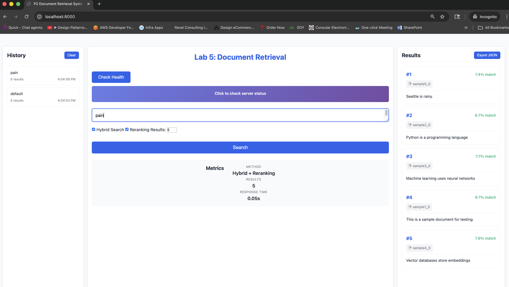
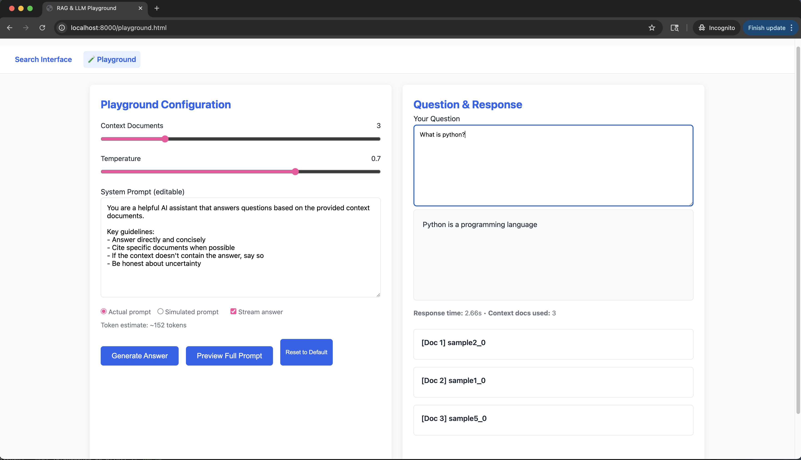
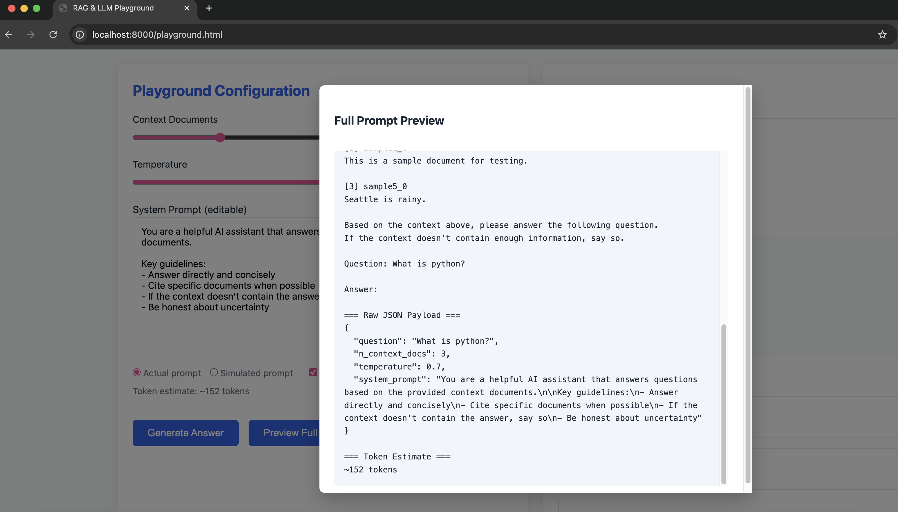

# Lab 5: Document Retrieval System

A semantic document retrieval system with a three-panel interactive web interface, built for  
**ARIN 5360 – Seattle University**.

The system supports semantic search, PDF ingestion, document chunking, optional reranking, and hybrid (keyword + semantic) retrieval, exposed via a FastAPI backend and a browser-based UI.

---

## CI Status

[](https://github.com/alokkatiyar11/p3-trial/actions/workflows/ci.yml)
---

## Features

- Semantic search using sentence transformers
- Automatic document chunking with overlap
- Support for `.txt` and `.pdf` documents
- Optional cross-encoder reranking
- Optional hybrid search (BM25 + semantic via RRF)
- REST API with FastAPI
- Three-panel responsive web UI (Lab 5)

---

## Web Interface (Lab 5)

The application includes a **three-panel responsive UI**:

### Left Panel (300px): Question History
- List of previous queries from the current session
- Clickable items to reload prior results
- Clear history button
- Empty state when no history exists

### Center Panel (Flexible): Query Input & Metrics
- Multi-line query input
- Hybrid Search and Reranking toggles
- Number of results input (default: 5, range: 1–20)
- Search button with loading state
- Metrics display:
  - Search method used
  - Result count
  - Response time

### Right Panel (400px): Results
- Scrollable list of result cards
- Export results as JSON
- Empty state before search

### Responsive Behavior
- Desktop (>1200px): three panels side-by-side
- Tablet/Mobile (<1200px): panels stack vertically
- Each panel scrolls independently

---

## Setup

### Prerequisites
- Python **3.10+** (recommended: 3.11)
- `uv` package manager

### Clone the Repository
```bash
git clone https://github.com/alokkatiyar11/p3-trial.git
cd p3-trial
```

### Install Dependencies
```bash
uv sync
```

### Environment Configuration

Create a local environment file from the template:

```bash
cp .env.example .env
```

Example `.env`:
```env
PORT=8000
LOG_LEVEL=INFO
```

---

## Running the Server

```bash
uv run uvicorn src.retrieval.main:app --reload
```

Open the web interface at:

```
http://localhost:8000
```

---
## Using Ollama for Local LLM Generation (Recommended for Playground & RAG)

The playground (`/playground.html`) and any generation features can use **Ollama** to run LLMs completely locally and privately (no API keys or internet required after model download).

Ollama runs an OpenAI-compatible API on `http://localhost:11434` by default.

### Ollama Setup Instructions

1. **Install Ollama**  
   Download and install from the official site:  
   https://ollama.com/download  
   Choose the version for your OS (macOS, Windows, Linux).

   - Linux one-liner (if preferred):  
     ```bash
     curl -fsSL https://ollama.com/install.sh | sh
     ```
2. **Open terminal and run**
     ```bash
     ollama serve
     ```
3. **Download / Pull a model**  
  In a new terminal, pull a model (examples):
    ```bash
    qwen2.5:3b
     ```
4. **Type a prompt to get a response**
---

## API Usage

### Health Check
```bash
curl http://localhost:8000/health
```

### Search
```bash
curl -X POST http://localhost:8000/search \
  -H "Content-Type: application/json" \
  -d '{
        "query": "machine learning",
        "n_results": 5,
        "use_hybrid": true,
        "use_reranking": true
      }'
```

---

## CI/CD Pipeline

This project uses **GitHub Actions** for continuous integration.

### What the Pipeline Does
The workflow defined in `.github/workflows/ci.yml` runs:

- **Linting & Formatting** using Ruff
- **Static Analysis** for bugs and best practices
- **Unit & Integration Tests** with pytest
- **Coverage Reporting** for the `src/retrieval` package

### When It Runs
- On every push to any branch
- On every pull request to `main`

A green check indicates the code is merge-ready.

---

## Running CI Checks Locally

```bash
# Linting
uv run ruff check .

# Formatting check
uv run ruff format --check .

# Auto-fix lint & formatting (optional)
uv run ruff check --fix .
uv run ruff format .

# Run all tests
uv run pytest

# Run tests with coverage
uv run pytest --cov=src/retrieval --cov-report=term

# Run smoke test only
uv run pytest tests/test_smoke.py
```

---

## Project Structure

```
src/retrieval/
├── loader.py        # Text & PDF loading + chunking
├── embeddings.py    # Bi-encoder embeddings
├── store.py         # ChromaDB vector store
├── retriever.py    # Retrieval orchestration
├── reranker.py     # Cross-encoder reranking
├── hybrid.py       # BM25 + RRF hybrid logic
├── main.py         # FastAPI application
├── llm.py          # NEW: LLM client
├── rag.py          # NEW: RAG system

static/
├── index.html          # Three-panel UI
├── search.js           # Frontend logic
├── style.css           # Layout & styling
├── playground.html     # NEW: Two-panel UI
├── playground.js       # NEW: Frontend logic
├── playground.css      # NEW: Layout & styling
tests/
├── test_llm.py      # NEW: LLM tests with mocks
├── rest_rag.py      # NEW: RAG tests with mocks
documents/
```

---

## Screenshots

### Three-Panel Web Interface
_Left: History · Center: Query & Metrics · Right: Results_

  
_Left: Playground Configuration · Right: Questions & Response_  
  
_Full Prompt Preview_

---

## Adding Documents

Place `.txt` or `.pdf` files in the `documents/` directory and restart the server.  
Documents are automatically indexed on startup.
